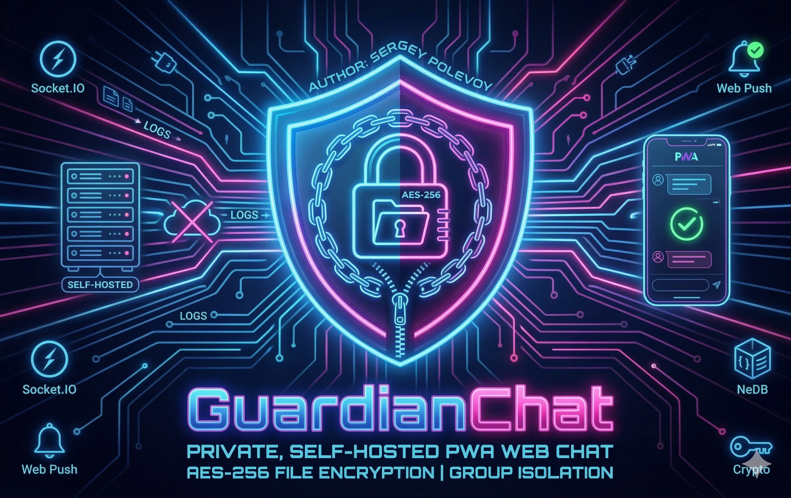

# 🛡️ Guardian Chat



Автор: Полевой Сергей

**Guardian Chat** — это приватный, самохостируемый веб-чат с поддержкой PWA, шифрованием файлов и строгим разделением прав доступа. Идеально подходит для команд и групп, требующих изолированного контура общения без посредников.

## ✨ Основные возможности

### 🔒 Безопасность и Конфиденциальность
*   **Self-Hosted**: Полный контроль над данными. История переписки, файлы и базы данных хранятся локально на вашем сервере (никаких облаков).
*   **Шифрование файлов**: Встроенная функция отправки файлов, защищенных паролем (AES-256-CTR). Файлы хранятся на диске в зашифрованном виде (`.enc`) и расшифровываются «на лету» только при скачивании с корректным паролем.
*   **Изоляция групп**: Пользователи видят только участников своих групп. Администраторы имеют доступ ко всем чатам.
*   **Премодерация доступа**: Новые пользователи после регистрации попадают в "Лист ожидания" и требуют ручного одобрения администратором.

### 📱 PWA (Progressive Web App)
*   **Установка**: Чат можно установить как нативное приложение на смартфон или десктоп.
*   **Offline-режим**: Благодаря Service Worker интерфейс загружается мгновенно даже при плохом соединении.
*   **Push-уведомления**: Поддержка Web Push API для уведомлений о сообщениях (работает даже при закрытой вкладке).

### 💬 Функционал чата
*   **Real-time**: Мгновенная доставка сообщений через Socket.IO.
*   **Интерактивность**: Статусы "В сети" и индикатор "Печатает...".
*   **Файлы**: Загрузка файлов чанками (поддержка больших файлов) и предпросмотр изображений.
*   **Персонализация**: Возможность установки индивидуальных фонов для разных чатов и групп.

## 🛠 Технический стек

*   **Backend**: Node.js, Express
*   **Database**: NeDB (быстрая встраиваемая JSON-база данных, не требует установки MongoDB/MySQL)
*   **Realtime**: Socket.IO
*   **Frontend**: EJS Templates, Vanilla JS (легковесный клиент)
*   **Security**: Bcrypt (хеширование паролей), Crypto (шифрование файлов), VAPID (подписи уведомлений)

## 🚀 Быстрый старт

Полная инструкция по развертыванию на хостинге находится в файле Install.md.

### Локальный запуск (для разработки):

1.  **Клонируйте репозиторий**:
    ```bash
    git clone https://github.com/POKEMOS64/Guardian_Chat.git
    ```

2.  **Установите зависимости**:
    ```bash
    npm install
    ```

3.  **Настройте ключи**:
    Сгенерируйте ключи для Push-уведомлений:
    ```bash
    node gen_keys.js
    ```
    *(Вставьте полученные ключи в `app.js` или используйте `.env`)*

4.  **Запустите сервер**:
    ```bash
    node app.js
    ```
    Откройте `http://localhost:3000`. Первый зарегистрированный пользователь станет **Администратором**.

## ⚖️ Disclaimer / Отказ от ответственности

Этот проект создан исключительно в образовательных целях и для личного (семейного) использования. 
Автор не несет ответственности за любой ущерб или неправомерное использование данного программного обеспечения третьими лицами. 
Используя Guardian Chat, вы подтверждаете, что действуете в рамках местного законодательства.